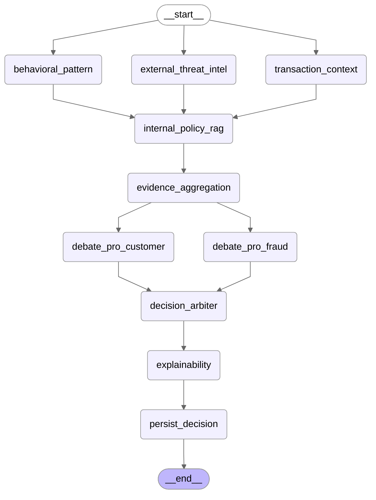

### Graph Topology

 
<!-- graph-topology:start -->

```mermaid
---
config:
  flowchart:
    curve: linear
  theme: neutral
---
graph TD;
	__start__([<p>__start__</p>]):::first
	transaction_context(transaction_context)
	behavioral_pattern(behavioral_pattern)
	external_threat_intel(external_threat_intel)
	internal_policy_rag(internal_policy_rag)
	evidence_aggregation(evidence_aggregation)
	debate_pro_fraud(debate_pro_fraud)
	debate_pro_customer(debate_pro_customer)
	decision_arbiter(decision_arbiter)
	explainability(explainability)
	persist_decision(persist_decision)
	__end__([<p>__end__</p>]):::last
	__start__ --> behavioral_pattern;
	__start__ --> external_threat_intel;
	__start__ --> transaction_context;
	behavioral_pattern --> internal_policy_rag;
	debate_pro_customer --> decision_arbiter;
	debate_pro_fraud --> decision_arbiter;
	decision_arbiter --> explainability;
	evidence_aggregation --> debate_pro_customer;
	evidence_aggregation --> debate_pro_fraud;
	explainability --> persist_decision;
	external_threat_intel --> internal_policy_rag;
	internal_policy_rag --> evidence_aggregation;
	transaction_context --> internal_policy_rag;
	persist_decision --> __end__;
	classDef default fill:#f2f0ff,line-height:1.2
	classDef first fill-opacity:0
	classDef last fill:#bfb6fc
```

<!-- graph-topology:end -->

