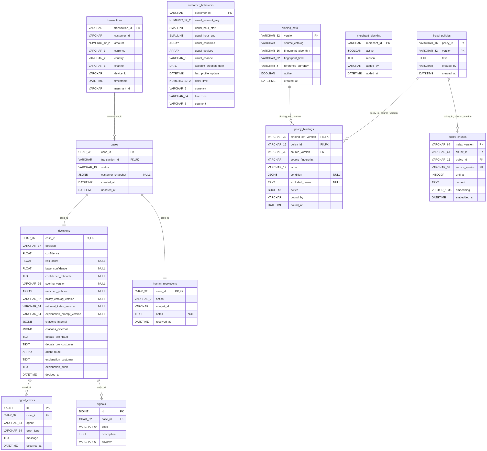

# Sistema Multi-Agente de Detección de Fraude

Analiza transacciones financieras con señales ambiguas —montos inusuales,
horarios atípicos, dispositivos desconocidos— y produce una decisión trazable:
`APPROVE`, `CHALLENGE`, `BLOCK` o `ESCALATE_TO_HUMAN`.

Un equipo de agentes orquestados evalúa la transacción contra el perfil
histórico del cliente, consulta las políticas internas por RAG, busca
inteligencia externa sobre amenazas mediante búsqueda web gobernada, debate la
evidencia desde dos posturas opuestas y arbitra un veredicto. Cada decisión
queda con sus señales, sus citas y su ruta de agentes en la base de datos, y las
que no alcanzan confianza suficiente pasan a una cola de revisión humana.

> Proyecto final del programa de especialización en IA Generativa.

---

## Estado

| Capa | Estado |
|---|---|
| Infraestructura local (Postgres + pgvector, migraciones) | ✅ |
| Modelo de dominio: 12 tablas, schemas de frontera | ✅ |
| Esqueleto del grafo: estado, topología, degradación | ✅ |
| Persistencia de la decisión | ✅ |
| Dataset sintético y ground truth | ✅ |
| Seed de la base desde el dataset | ✅ |
| Agentes determinísticos (Context, Behavioral, Aggregation) | ✅ |
| Catálogo de políticas en Postgres (documento + vinculación) | ✅ |
| Índice vectorial de políticas, versionado y sellado | ✅ |
| RAG de políticas internas: autorización + descubrimiento | ✅ |
| Arbiter determinístico (brazo de control del entregable 7) | ✅ |
| Explicabilidad: auditoría por plantilla, cliente por LLM | ✅ |
| Tabla `web_search_allowlist` | ⬜ |
| Búsqueda web gobernada + Threat Intel Agent | ⬜ |
| Agentes con LLM (Debate x2, Arbiter agéntico) | ⬜ |
| API FastAPI + HITL | ⬜ |
| CI, imagen y despliegue | ⬜ |

---

## Cómo se arma una cita interna

La decisión de fondo del sistema, y la que más se aparta de un RAG convencional:
**`citations_internal` no sale de la búsqueda vectorial**.

Si saliera, el motor podría disparar FP-03, el índice devolver FP-05 y FP-02, y
el caso decidirse `BLOCK` —correctamente— **citando normas que no aplicó**. No
hay excepción, la lista no está vacía, y el auditor recibe una explicación
coherente y falsa.

Por eso se resuelve por dos caminos, y lo que se persiste es su unión
([ADR-0011](docs/adr/0011-citacion-por-identidad-descubrimiento-por-similitud.md)):

| Camino | Cómo | Aporta | Garantía |
|---|---|---|---|
| **Autorización** | lookup por `policy_id` contra el catálogo | toda política que disparó | **total** |
| **Descubrimiento** | búsqueda vectorial desde los códigos de señal | políticas relacionadas que **no** dispararon | ninguna |

La autorización **no consulta el índice ni la red**: por eso sobrevive a un
documento publicado y sin indexar, y a que el proveedor de embeddings no
responda. Verificado: con el proveedor caído, el mismo caso sigue en `BLOCK`
citando FP-03, con la confianza degradada de 0.4 a 0.25.

---

## Topología del grafo


La topología no se diseñó dibujando cajas: se derivó de las dependencias de
datos, con una sola regla —**dos nodos corren en paralelo si y solo si ninguno
lee lo que el otro escribe**—. De ahí salen siete *supersteps*:

| # | Nodos | Qué hace |
|---|---|---|
| 0 | `transaction_context` ∥ `behavioral_pattern` ∥ `external_threat_intel` | Recolección de evidencia |
| 1 | `internal_policy_rag` | Cita por identidad y descubre por similitud |
| 2 | `evidence_aggregation` | Deduplica, ordena y calcula la confianza determinística |
| 3 | `debate_pro_fraud` ∥ `debate_pro_customer` | Deliberación |
| 4–5 | `decision_arbiter` → `explainability` | Veredicto y explicación |
| 6 | `persist_decision` | Cierre |

El grafo no tiene aristas condicionales: `DECIDED` y `PENDING_HUMAN` son valores
de `status` que escribe el mismo nodo, no una bifurcación.

El diagrama se genera desde el grafo compilado
(`scripts/export_graph_diagram.py`), no se dibuja a mano.

> `decision_arbiter` es hoy la **línea base determinística**: el veredicto que el
> catálogo prescribe por precedencia. No es el Arbiter final —es el brazo de
> control contra el que se mide el enfoque agéntico ([ADR-0006](docs/adr/)).

---

## Modelo de datos



Doce tablas. También se **genera** desde `Base.metadata`
(`scripts/export_data_model_diagram.py`), por el mismo motivo por el que se
genera la topología: el diagrama dibujado a mano se había atrasado dos etapas sin
que nadie lo notara.

```bash
uv run python scripts/export_data_model_diagram.py --check   # gate, sin red
```

Retorna distinto de cero si el modelo cambió y el diagrama no. Junto a
`alembic check` cubre los dos desfases posibles: modelo sin migración y modelo
sin diagrama.

---

## Auditoría en cuatro ejes

Cada decisión sella con qué se produjo. Ninguno de los cuatro se puede derivar de
los otros, porque los cuatro artefactos cambian por separado:

| Eje | Sello | `null` significa |
|---|---|---|
| Qué texto se citó | `InternalCitation.version` | — |
| Qué traducción se evaluó | `policy_catalog_version` | — |
| Con qué índice se recuperó | `retrieval_index_version` | no hubo recuperación |
| Con qué prompt se redactó | `explanation_prompt_version` | ningún modelo participó |

Las cadenas son descriptivas y no identificadores opacos
(`gemini-embedding-2:1536:doc:1`): el motivo de sellarlas es que alguien las lea.
Por lo mismo, **el modelo no es variable de entorno** — uno configurable por
`env` podría cambiarse sin que suba la versión sellada, y los cuatro sellos
mentirían a la vez ([ADR-0012](docs/adr/0012-el-indice-vectorial-es-dato-derivado-y-versionado.md)).

---

## Stack

| Herramienta | Rol |
|---|---|
| Python 3.12 · [uv](https://docs.astral.sh/uv/) | Runtime y gestor de proyecto (build reproducible con `uv.lock`) |
| PostgreSQL 18 + pgvector | Base relacional **y** vectorial ([ADR-0001](docs/adr/0001-postgres-con-pgvector-como-unica-base.md)) |
| SQLAlchemy 2.0 (async) + psycopg3 | ORM y driver |
| Alembic | Migraciones versionadas (motor síncrono) |
| Pydantic v2 | Validación en la frontera |
| LangGraph | Orquestación del grafo de agentes |
| Gemini (`gemini-embedding-2`) | Embeddings: recuperación |
| Anthropic (`claude-sonnet-5`) | Generación: explicación al cliente |

Dos proveedores, dos roles y dos sellos. Los dos entran **por un puerto**:
cambiar de proveedor es un adaptador y una versión nueva, no una reescritura.

---

## Puesta en marcha

Requisitos: Python 3.12, [uv](https://docs.astral.sh/uv/getting-started/installation/)
y Docker.

```bash
# 1. Dependencias
uv sync

# 2. Configuración
cp .env.example .env

# 3. Base de datos
docker compose up -d

# 4. Migraciones
uv run alembic upgrade head

# 5. Dataset, catálogo e índice vectorial
uv run python scripts/seed.py
```

`.env` trae valores por defecto que funcionan tal cual en local. `DATABASE_URL`
y `ENVIRONMENT` bastan para todo salvo el índice y la explicación al cliente:
`GEMINI_API_KEY` y `ANTHROPIC_API_KEY` son opcionales, y sin ellas el sistema
sigue decidiendo con el descubrimiento vacío y la explicación por plantilla.

---

## Verificación

### Gates determinísticos — sin red, sin base

```bash
uv run pytest
uv run python scripts/check_policies.py                        # 7000/7000
uv run python scripts/export_data_model_diagram.py --check
uv run python scripts/validate_dataset.py
```

### Gates contra la base

```bash
docker compose up -d && uv run alembic upgrade head && uv run python scripts/seed.py

uv run python scripts/check_policies.py --source=db   # el catálogo desde Postgres
uv run python scripts/check_retrieval.py              # ablación del descubrimiento
```

### Smoke tests

```bash
uv run python scripts/smoke_read.py             # round-trip de la capa Read
uv run python scripts/smoke_graph.py            # supersteps, reducers, input_schema
uv run python scripts/smoke_degradation.py      # un agente caído no aborta el grafo
uv run python scripts/smoke_persistence.py      # un reintento no duplica señales
uv run python scripts/smoke_catalog_sources.py  # archivo y base dan el mismo catálogo
uv run python scripts/smoke_retrieval.py        # la búsqueda no mezcla generaciones
uv run python scripts/smoke_decision.py         # un caso aprobado y uno bloqueado
```

### Regenerar artefactos derivados

```bash
uv run python scripts/export_graph_diagram.py        # requiere conexión
uv run python scripts/export_data_model_diagram.py   # requiere conexión
uv run python scripts/index_policies.py              # índice vectorial
uv run python scripts/generate_data.py               # perfiles y transacciones
uv run python scripts/build_ground_truth.py          # etiquetas del harness
```

Todos los generadores son deterministas: `git diff --exit-code` después de
regenerar es una guarda válida de CI.

---

## Estructura

```
├── compose.yml                  # Postgres 18 + pgvector
├── migrations/versions/         # 10 revisiones · head: catálogo y sellos
├── scripts/                     # gates, smoke tests y generadores
├── data/
│   ├── policies/                # documento normativo + vinculaciones
│   ├── customer_behaviors.csv
│   ├── ground_truth.csv
│   ├── transactions.csv
│   └── README.md
├── docs/
│   ├── contrato_de_interfaz.md  # documento vivo (v0.6)
│   ├── CHANGELOG.md
│   ├── enmiendas_pendientes.md  # staging de la próxima versión
│   ├── runbook_base_nueva.md
│   ├── adr/                     # decisiones de arquitectura
│   ├── reviews/                 # cierres de etapa
│   └── diagrams/
└── src/multiagent_fraud_detection/
    ├── enums.py
    ├── config/                  # settings (pydantic-settings)
    ├── db/                      # engine async, Base, 12 modelos, repositorios
    ├── domain/                  # predicados, catálogo, motor de reglas
    ├── retrieval/               # chunking, embeddings, índice, query, citas
    ├── explain/                 # auditoría por plantilla, cliente por LLM
    ├── schemas/                 # frontera pública (Pydantic)
    └── graph/                   # state, nodes, builder, context
```

---

## Documentación

- **[Contrato de interfaz](docs/contrato_de_interfaz.md)** — las dos fronteras
  del sistema: la operativa (empaquetado, configuración, health) y la de API
  (endpoints y schemas). Incluye el modelo de persistencia.
- **[`data/README.md`](data/README.md)** — el dataset sintético: esquema de los tres
  archivos, semántica de las etiquetas, confusores y limitaciones.
- **[CHANGELOG](docs/CHANGELOG.md)** — qué cambió entre versiones del contrato y
  por qué.
- **[ADR](docs/adr/)** — decisiones de arquitectura, cada una con la alternativa
  que se descartó.
- **[Reviews](docs/reviews/)** — cierres de etapa, en orden cronológico.
- **[Enmiendas pendientes](docs/enmiendas_pendientes.md)** — lo que va hacia la
  próxima versión del contrato.
- **[Runbook de base nueva](docs/runbook_base_nueva.md)** — poner en marcha una
  base vacía: crear, verificar, migrar, sembrar y comprobar.

### Diagramas

| Archivo | Origen | Vigencia |
|---|---|---|
| `graph_topology.png` | generado del grafo compilado | automática |
| `data_model.png` · `.mmd` | generado de `Base.metadata` | automática, con `--check` |
| `citacion-interna.drawio` | a mano | se revisa al cerrar etapa |
| `c4-container.drawio` | a mano — **vista C4 vigente** | se revisa al cerrar etapa |
| `ciclo-de-vida.drawio` | a mano | se revisa al cerrar etapa |
| `capa1-infra.drawio` | a mano — **histórico de la etapa 1**, no se actualiza | congelado |
| `transaction-flow.drawio` | a mano — apoyo de la etapa 1 | congelado |

Lo que se genera no deriva; lo que se dibuja a mano sí. `modelo-datos.drawio` se
había atrasado dos etapas antes de que alguien lo notara, y por eso el modelo de
datos pasó a generarse. Los que siguen a mano son los que codifican **juicio**
—qué está construido, qué garantiza cada camino— y no estructura.

La documentación sigue **C4** (Context → Container → Component → Code) como
columna estructural, más vistas dinámicas, y se escribe incrementalmente al
cerrar cada etapa.
