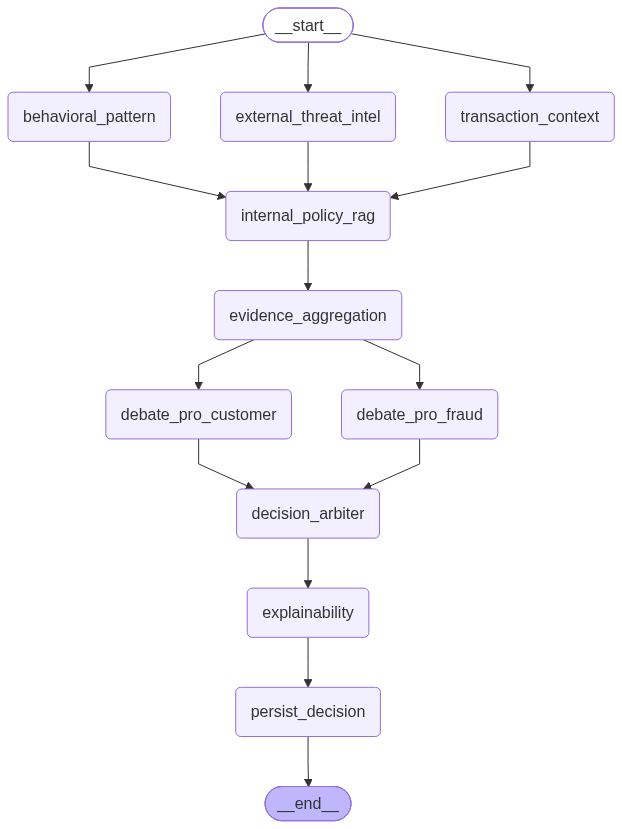

# Sistema Multi-Agente de Detección de Fraude

Analiza transacciones financieras con señales ambiguas —montos inusuales,
horarios atípicos, dispositivos desconocidos— y produce una decisión trazable:
`APPROVE`, `CHALLENGE`, `BLOCK` o `ESCALATE_TO_HUMAN`.

Un equipo de agentes orquestados evalúa la transacción contra el perfil
histórico del cliente, consulta las políticas internas por RAG, busca
inteligencia externa sobre amenazas mediante búsqueda web gobernada, debate la
evidencia desde dos posturas opuestas y arbitra un veredicto. Cada decisión
queda con sus señales, sus citas y su ruta de agentes en la base de datos, y las
que no alcanzan confianza suficiente pasan a una cola de revisión humana.

> Proyecto final del programa de especialización en IA Generativa.

---

## Estado

| Capa | Estado |
|---|---|
| Infraestructura local (Postgres + pgvector, migraciones) | ✅ |
| Modelo de dominio: 6 tablas, schemas de frontera | ✅ |
| Esqueleto del grafo: estado, topología, degradación | ✅ |
| Persistencia de la decisión | ⬜ |
| Agentes de lógica pura (Context, Behavioral, Aggregation) | ⬜ |
| Tabla `web_search_allowlist` | ⬜ |
| RAG de políticas internas + Policy RAG Agent | ⬜ |
| Búsqueda web gobernada + Threat Intel Agent | ⬜ |
| Agentes con LLM (Debate x2, Arbiter, Explainability) | ⬜ |
| API FastAPI + HITL | ⬜ |
| CI, imagen y despliegue | ⬜ |

---

## Topología del grafo



La topología no se diseñó dibujando cajas: se derivó de las dependencias de
datos, con una sola regla —**dos nodos corren en paralelo si y solo si ninguno
lee lo que el otro escribe**—. De ahí salen siete *supersteps*:

| # | Nodos | Qué hace |
|---|---|---|
| 0 | `transaction_context` ∥ `behavioral_pattern` ∥ `external_threat_intel` | Recolección de evidencia |
| 1 | `internal_policy_rag` | Recupera políticas usando las señales ya detectadas como query |
| 2 | `evidence_aggregation` | Deduplica, ordena y calcula la confianza determinística |
| 3 | `debate_pro_fraud` ∥ `debate_pro_customer` | Deliberación |
| 4–5 | `decision_arbiter` → `explainability` | Veredicto y explicación |
| 6 | `persist_decision` | Cierre |

El grafo no tiene aristas condicionales: `DECIDED` y `PENDING_HUMAN` son valores
de `status` que escribe el mismo nodo, no una bifurcación.

El diagrama se genera desde el grafo compilado
(`scripts/export_graph_diagram.py`), no se dibuja a mano.

---

## Stack

| Herramienta | Rol |
|---|---|
| Python 3.12 · [uv](https://docs.astral.sh/uv/) | Runtime y gestor de proyecto (build reproducible con `uv.lock`) |
| PostgreSQL 17 + pgvector | Base relacional **y** vectorial ([ADR-0001](docs/adr/0001-postgres-con-pgvector-como-unica-base.md)) |
| SQLAlchemy 2.0 (async) + psycopg3 | ORM y driver |
| Alembic | Migraciones versionadas (motor síncrono) |
| Pydantic v2 | Validación en la frontera |
| LangGraph | Orquestación del grafo de agentes |

---

## Puesta en marcha

Requisitos: Python 3.12, [uv](https://docs.astral.sh/uv/getting-started/installation/)
y Docker.

```bash
# 1. Dependencias
uv sync

# 2. Configuración
cp .env.example .env

# 3. Base de datos
docker compose up -d

# 4. Migraciones
uv run alembic upgrade head
```

`.env` trae valores por defecto que funcionan tal cual en local. La única
variable que la aplicación conoce es `DATABASE_URL`; el resto las lee
`compose.yml` por interpolación.

---

## Verificación

Cuatro *smoke tests* comprueban cada capa. Todos necesitan la base arriba y las
migraciones aplicadas.

```bash
docker compose up -d && uv run alembic upgrade head

uv run python scripts/smoke_read.py          # round-trip de la capa Read
uv run python scripts/smoke_graph.py         # supersteps, reducers, input_schema
uv run python scripts/smoke_degradation.py   # un agente caído no aborta el grafo
uv run python scripts/smoke_persistence.py   # un reintento no duplica señales
```

Regenerar el diagrama de topología (requiere conexión a internet):

```bash
uv run python scripts/export_graph_diagram.py
```

---

## Estructura

```
├── compose.yml                  # Postgres 17 + pgvector
├── migrations/versions/         # c558 pgvector · b2a8 · 97de · ac3b (head)
├── scripts/                     # smoke tests y utilidades
├── docs/
│   ├── contrato_de_interfaz.md  # documento vivo (v0.3)
│   ├── CHANGELOG.md
│   ├── enmiendas_pendientes.md  # staging de la próxima versión
│   ├── adr/                     # decisiones de arquitectura
│   ├── reviews/                 # cierres de etapa
│   └── diagrams/
└── src/multiagent_fraud_detection/
    ├── enums.py
    ├── config/                  # settings (pydantic-settings)
    ├── db/                      # engine async, Base, 6 modelos ORM
    ├── schemas/                 # frontera pública (Pydantic)
    └── graph/                   # state, nodes, builder
```

---

## Documentación

- **[Contrato de interfaz](docs/contrato_de_interfaz.md)** — las dos fronteras
  del sistema: la operativa (empaquetado, configuración, health) y la de API
  (endpoints y schemas). Incluye el modelo de persistencia.
- **[CHANGELOG](docs/CHANGELOG.md)** — qué cambió entre versiones del contrato y
  por qué.
- **[ADR](docs/adr/)** — decisiones de arquitectura, cada una con la alternativa
  que se descartó.
- **[Reviews](docs/reviews/)** — cierres de etapa, en orden cronológico.
- **[Enmiendas pendientes](docs/enmiendas_pendientes.md)** — lo que va hacia la
  próxima versión del contrato.

La documentación sigue **C4** (Context → Container → Component → Code) como
columna estructural, más vistas dinámicas, y se escribe incrementalmente al
cerrar cada etapa.
