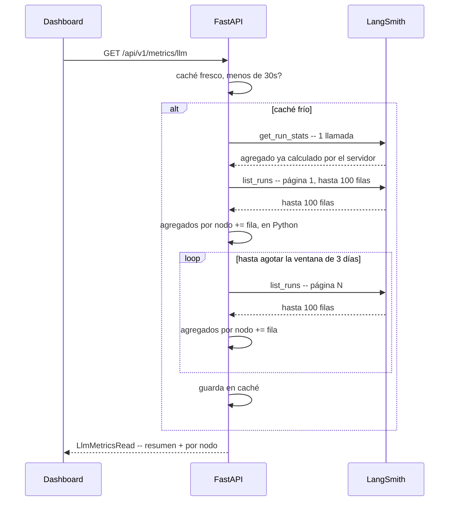

# Notas — LangSmith en producción, no sólo en el papel

> **No es un cierre de etapa** — no corresponde un número de la secuencia
> `01`…`10`. Es un documento vivo: junta lo que se fue verificando y
> aprendiendo al conectar LangSmith de verdad (wiring, API de lectura,
> bugs reales), separado de por qué se lo eligió (eso ya está en
> ADR-0013) y de la decisión de servirlo al dashboard (ADR-0019). Se sigue
> completando mientras el trabajo sobre LangSmith continúe — última
> actualización: por qué el desglose por nodo era lento y cómo se
> resolvió (§5, PR #36).

---

## 1. Qué ya estaba decidido, y qué faltaba

LangSmith es la capa de observabilidad del proyecto **desde la primera
acta de revisión** (`reviews/01-fundacion-bd.md`, tabla de stack: *"LangSmith
cubre monitoreo (6) y evals (7)"*), y el contrato declara
`LANGSMITH_API_KEY`/`LANGSMITH_TRACING`/`LANGSMITH_PROJECT` desde su v0.1.
Lo que faltaba no era la decisión — era conectar código real. Eso se cerró
en `feature/langsmith-observability` (PR #15): `wrap_anthropic()` sobre los
tres clientes crudos (`judge.py`, `narrator.py`, `searcher.py`).

**Por qué `wrap_anthropic` y no migrar a `ChatAnthropic` (LangChain)**:
migrar habría exigido rehacer la salida estructurada nativa de `judge.py`
(`messages.parse`) y la herramienta de búsqueda web nativa de `searcher.py`
(`web_search_20250305`) — ninguna con equivalente maduro en LangChain hoy.
`wrap_anthropic` traza sin tocar esa integración. La migración queda
anotada como exploración futura, con su propio ADR si se retoma (no es
parte de esto).

## 2. El caso que `wrap_anthropic` no cubre

`wrap_anthropic` sólo parchea `messages.create` y `beta.messages.parse`.
`judge.py` usa `messages.parse` (la rama **estable**, no la beta) porque
llama a `self._post` directo por debajo — quedaba sin trazar en silencio,
sin ningún error que lo delatara. Se resolvió envolviendo esa llamada
puntual con `@traceable(run_type="llm", ...)` a mano
(`src/multiagent_fraud_detection/arbiter/judge.py`).

Ese wrapping manual trajo dos problemas reales, encontrados verificando
contra el proyecto real (no en teoría):

### 2.1 Warning de Pydantic en cada veredicto del Arbiter

`messages.parse()` devuelve un `ParsedMessage` cuyo `content` es
`ParsedTextBlock[ArbiterVerdict]` — un tipo genérico exclusivo de esa rama,
que no calza con la unión de bloques (`ThinkingBlock`, `ToolUseBlock`, etc.)
que el SDK declara para el `content` general. `traceable` necesita
serializar lo que la función devuelve para armar la traza, y ahí Pydantic
tira un `PydanticSerializationUnexpectedValue` por cada miembro de la unión
que no matchea — de ahí la lista larga de warnings en el log del backend.
No rompía nada (el veredicto seguía siendo correcto), pero era ruido en
cada corrida.

### 2.2 El costo del Arbiter aparecía en $0

Más grave: sin un `process_outputs` que supiera leer ese `ParsedMessage`,
LangSmith nunca extraía `usage` — `decision_arbiter`/`AnthropicJudge.judge`
mostraban **$0 y 0 tokens** en LangSmith pese a generar tokens reales.
Verificado en vivo contra el proyecto real antes y después del fix.

**El fix a los dos problemas es el mismo cambio**: LangSmith ya tiene, en
su propio wrapper (`langsmith/wrappers/_anthropic.py`, función privada
`_message_to_outputs`), el serializador que sabe manejar exactamente este
caso (el propio código fuente lo comenta: *"ParsedBetaMessage/ParsedMessage
... carry user-defined Pydantic models ... trigger
PydanticSerializationUnexpectedValue warnings ... Suppress for parsed
types"*). Reusarlo como `process_outputs` calla el warning. Y para que
LangSmith calcule el **costo** en dólares (no sólo cuente tokens) hace
falta además decirle qué proveedor/modelo fue, con
`metadata={"ls_provider": "anthropic", "ls_model_name": self.model}` —
sin esto, `usage_metadata` ya cuenta tokens bien pero LangSmith no sabe con
qué tarifa convertirlos a costo. Los dos, juntos, en el mismo
`traceable(...)` de `judge.py`.

## 3. De dónde sale cada dato — para no tratarlo como una caja negra

Pregunta que vale la pena responder por escrito, porque no es obvia:
**¿el costo/tokens vienen del proveedor o los inventa LangSmith?**

- **Los tokens crudos (`input_tokens`/`output_tokens`) vienen de la
  respuesta de Anthropic**, no de LangSmith — es el mismo campo `usage`
  que cualquier código que llame a la API recibe. Confirmado leyendo el
  código fuente instalado (`_create_usage_metadata` en `_anthropic.py`
  toma `anthropic_token_usage.get("input_tokens")` directo de la
  respuesta cruda del SDK).
- **El costo en dólares sí lo agrega LangSmith** — la respuesta de
  Anthropic no trae un campo de precio; LangSmith lo calcula con su propia
  tabla de tarifas por modelo (de ahí que haga falta `ls_model_name`: sin
  saber el modelo, no sabe qué tarifa aplicar).
- **La agregación (percentiles, promedios, tasa de error) también la da
  LangSmith** — replicarla sin LangSmith exigiría persistir cada `usage`
  nosotros mismos (tabla nueva, migración) y calcular esas estadísticas a
  mano.

Por qué no vale la pena hacerlo distinto, ya que se preguntó explícitamente:
sería pagar de nuevo, con código propio, un costo que ya se pagó una vez al
adoptar LangSmith como capa de observabilidad (ADR-0013) — y además
perdería la atribución por nodo del grafo gratis (ver §4).

## 4. La API de lectura — lo que da, y sus filos

- **`client.get_run_stats(project_names=[...], is_root=True)`** — un solo
  llamado, agregado completo: `run_count`, `latency_p50`/`latency_p99`,
  `total_tokens`, `prompt_tokens`/`completion_tokens`, `total_cost`,
  `cost_p50`/`cost_p99`, `error_rate`. Verificado contra el proyecto real.
- **`client.list_runs(project_name=..., is_root=False)`** — corridas
  hijas; `run.name` es el nombre real del nodo del grafo (LangGraph nombra
  cada span hijo con el nombre del nodo, sin configuración extra). Cada
  nodo tipo `chain` (p. ej. `debate_pro_fraud`) ya trae **acumulado** el
  costo/tokens de sus descendientes LLM (`ChatAnthropic`,
  `AnthropicJudge.judge`) — sumarlos aparte duplicaría el costo, no lo
  completaría.
- **`list_runs` está deprecado** (se retira después de 2027-01-31) a favor
  de `client.runs.query()`. En la versión instalada
  (`langsmith==0.10.18`) esa API nueva **no es reemplazo directo**:
  `query_v2() got an unexpected keyword argument 'project_name'` — firma
  distinta, no madura todavía. Deuda anotada, más de un año de margen.
- **`list_runs(limit=N)` no es un tope total — es el tamaño de página**, y
  la API rechaza cualquier valor mayor a 100
  (`"Limit exceeds maximum allowed value of 100"`). Sin `limit`, el
  generador pagina solo hasta agotar el proyecto; ponerle un número alto
  "para ser generoso" no lo acota, lo rompe.

## 5. Por qué el desglose por nodo era lento — servidor vs. cliente

Pregunta que también vale la pena responder por escrito, porque tampoco es
obvia: cuando `GET /api/v1/metrics/llm` tardaba casi un minuto en la
primera visita de cada deploy, ¿ese recorrido pasaba en los servidores de
LangSmith o en nuestro propio proceso? Las dos llamadas de
`_consultar_langsmith_sync`
(`src/multiagent_fraud_detection/api/routers/metrics.py`) responden
distinto:

- **`client.get_run_stats(...)` — agregación real, del lado del
  servidor.** Un solo request; LangSmith ya tiene el conteo, el costo
  total y los percentiles calculados en su base, y los devuelve en una
  respuesta. Rápida sin importar cuánta historia haya — es justo el tipo
  de trabajo para el que una base de datos está hecha.
- **`client.list_runs(...)` — no es una agregación, es un listado
  paginado.** Cada página trae como máximo 100 filas (tope real del
  servidor: pedir más devuelve `"Limit exceeds maximum allowed value of
  100"`, confirmado en vivo, §4). El generador de la SDK hace un
  round-trip HTTP por página, por debajo, cada vez que el `for` sigue
  pidiendo la próxima.
- **El agrupado por nodo es código nuestro, en nuestro proceso — no algo
  que LangSmith ofrezca.** No existe (o este proyecto no la usa) una API
  de lectura que responda directamente "cuántas veces corrió
  `debate_pro_fraud` y con qué latencia/costo promedio". Para saber eso
  hace falta traer cada fila individual y sumarla a mano
  (`agregados[corrida.name] += ...`), así que el trabajo crece con el
  **total de corridas en el rango pedido**, no con lo que realmente
  importa mostrar (el estado reciente del sistema).



**Números reales, medidos contra el proyecto de este portafolio** (no son
un benchmark de LangSmith en general, son lo que se observó acá):

| Ventana | Corridas | Tiempo | Páginas aprox. |
|---|---|---|---|
| sin acotar (todo el historial) | 1624 | 93.00s | ~17 |
| últimos 7 días | 308 | 6.97s | ~4 |
| últimas 72 horas | 196 | 2.38s | ~2 |

Más páginas explica parte de la diferencia, pero no toda: el tiempo por
página también bajó acotando (~5.5s/página sin acotar vs. ~1.2–1.7s/página
acotado, en las mismas corridas de arriba). Eso queda anotado como
**observado, no confirmado** — a diferencia del resto de este §, no es
código instalado que se pueda leer para verificarlo; es una hipótesis
razonable (una consulta sin filtro de fecha probablemente escanea más del
lado del servidor también), no un hecho comprobado contra el código
interno de LangSmith.

**El fix real** (PR #36): `VENTANA_RECIENTE = timedelta(days=3)` acota las
dos llamadas al mismo rango —para que el resumen y el desglose por nodo
no queden inconsistentes entre sí— y `precalentar()` dispara esa consulta
una vez al arrancar el proceso, de fondo, sin bloquear `/ready`, para que
ni el primer visitante después de cada deploy pague el costo (acotado a
`environment == "production"`, para no disparar una llamada de red real
en cada corrida de `pytest`).

## 6. Cómo probarlo de punta a punta (repetible)

1. API key real desde la cuenta de LangSmith.
2. En `.env` (nunca `.env.example`):
   ```
   LANGSMITH_API_KEY=ls-...
   LANGSMITH_TRACING=true
   LANGSMITH_PROJECT=fraud-detection
   ```
3. Disparar un caso real con proveedores reales — desde el dashboard
   (Transactions → "Ejecutar" en cualquier fila de "Ejecutar en vivo") o
   por consola (`uv run python scripts/smoke_decision.py`, cinco
   escenarios reales, no necesita levantar el servidor).
4. Confirmar las trazas en el proyecto de LangSmith, o contra
   `GET /api/v1/metrics/llm` (implementado — mecánica interna en §5).

## 7. Números de referencia (una corrida real, para calibrar expectativas)

No son un SLA, son lo que se observó verificando en vivo — útil para no
sorprenderse la próxima vez:

| Nodo | Latencia típica | Costo típico |
|---|---|---|
| `transaction_context` / `behavioral_pattern` / `external_threat_intel` | ~0.01–0.02s (paralelo, sin LLM salvo señal puntual) | — |
| `internal_policy_rag` | ~0.6–1.1s (RAG, embeddings) | — |
| `debate_pro_fraud` + `debate_pro_customer` | ~4.2–5.5s cada uno (paralelo entre sí, manda el más lento) | ~$0.0035–0.0040 c/u |
| `decision_arbiter` | ~4.6–4.8s | ~$0.0019–0.0030 |
| `explainability` | ~2.5s | ~$0.0021–0.0023 |
| `persist_decision` | ~0.01s | — |

**Camino crítico total** (debate → arbiter → explain, secuencial, es lo
que domina): ~11–17s por decisión. **Costo total por decisión**: ~$0.009–
$0.012. No es apto para gatear una autorización sincrónica (point-of-sale
necesita sub-segundo) — pero este sistema no lo usa así: `POST /cases`
devuelve `202` de inmediato y el análisis con LLM es un enriquecimiento
posterior, no el gate (ese es el motor de reglas determinístico). Detalle
completo de esta lectura en la conversación que motivó este documento; se
resume acá para no perderlo.

## 8. Qué sigue (deuda / trabajo en curso)

- **`GET /api/v1/metrics/llm`** (ADR-0019, v0.12 del contrato): sirve el
  resumen y el desglose por nodo al dashboard — implementado. El bug de
  performance del primer request tras cada deploy (~1 minuto en blanco)
  está resuelto — ver §5.
- **Grafo en vivo al costado de la tabla, sincronizado con el fin de una
  corrida** — en curso al momento de escribir esto: descubrir el caso en
  `ANALYZING` vía `GET /cases?status=ANALYZING`, reusar `useCaseProgress`
  (SSE, ADR-0018), y un `?force=true` en `/metrics/llm` para refrescar la
  tabla en el mismo instante en que el grafo termina, sin esperar el
  caché de 30s. ADR propio (0020) cuando se cierre.
- **Migrar de `list_runs` a `client.runs.query()`** cuando la firma de esa
  API madure en una versión más nueva del SDK — no bloquea nada hoy.
